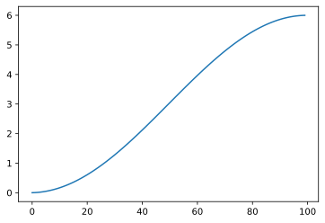

## Name

and some text \\(i\hbar\frac{\partial}{\partial t} \Psi(\mathbf{r},t) \\) and another inline $\frac{\partial}{\partial t} \Psi(\mathbf{r},t) $

$$ i\hbar\frac{\partial}{\partial t} \Psi(\mathbf{r},t) = \left [ \frac{-\hbar^2}{2\mu}\nabla^2 + V(\mathbf{r},t)\right ] \Psi(\mathbf{r},t) $$

you can edit just inline $\int_{-\infty}^{\infty} f(x) \operatorname{d}x$

and for inline \\(i\hbar\frac{\partial}{\partial t} \Psi(\mathbf{r},t) = \left [ \frac{-\hbar^2}{2\mu}\nabla^2 + V(\mathbf{r},t)\right ] \Psi(\mathbf{r},t)\\)

and something else...

### Three header...

$i\hbar\frac{\partial}{\partial t} \Psi(\mathbf{r},t) = \left [ \frac{-\hbar^2}{2\mu}\nabla^2 + V(\mathbf{r},t)\right ] \Psi(\mathbf{r},t)$

| entry | second | third |
| ----- | ------ | :---- |
| 132   | 324    | 523   |
| 32    | 32.000 | 32342 |
|       |        |       |

And now what does that mean?

------

